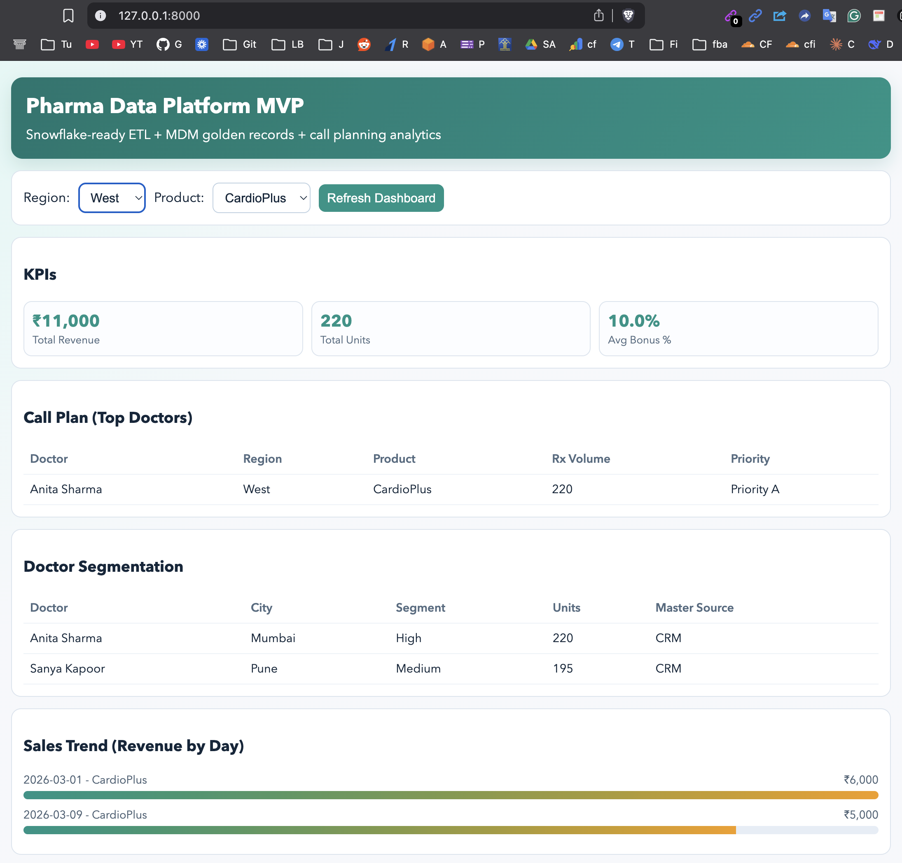

# Pharma Data Platform (Snowflake + ETL + MDM + Analytics)

Lightweight prototype you can run locally in browser.


## What this includes
- ETL pipeline (`extract_csv -> clean_transform -> load_to_snowflake/local`)
- Snowflake-ready loader using `snowflake-connector-python`
- MDM golden record logic (`CRM > IQVIA` priority) with SQL window functions
- Data quality scoring and ETL run logs
- FastAPI analytics endpoints:
  - `/doctors`
  - `/sales`
  - `/call-plan`
  - `/incentives`
- Browser dashboard (`/`) with filters and trend visuals

## Architecture
```text
CSV (CRM + IQVIA + Sales)
   -> ETL (Python)
   -> Snowflake (or local SQLite for demo)
   -> MDM SQL layer (dim + fact)
   -> FastAPI
   -> Browser Dashboard
```




## Quick start (local demo)
1. Create and activate environment:
```bash
cd /Users/homesachin/Desktop/zoneone/practice/pharma-data-platform-mvp
python3 -m venv .venv
source .venv/bin/activate
pip install -r requirements.txt
```

2. Keep local mode (default):
```bash
cp .env.example .env
```

3. Run ETL:
```bash
python etl/run_pipeline.py
```

4. Start API + Dashboard:
```bash
uvicorn app.main:app --reload --port 8000
```

5. Open in browser:
```text
http://127.0.0.1:8000
```

## Snowflake mode
1. Edit `.env` and set:
- `WAREHOUSE_MODE=snowflake`
- Snowflake account/user/password/warehouse/database/schema values

2. Run ETL again:
```bash
python etl/run_pipeline.py
```

This loads:
- `raw_doctors_data`
- `raw_sales_data`
- `dim_doctor`
- `fact_sales`

## MDM logic used
- Matching key: normalized `name + city`
- Conflict resolution: `CRM` rows ranked above `IQVIA`
- Golden ID: generated `DOC-0001` style ID

## Airflow (optional)
DAG file: `etl/airflow/dags/pharma_etl_dag.py`

For lightweight interviews, running `etl/run_pipeline.py` is enough to demo ETL + MDM flow.

## ETL quality + observability
- Data quality score field added to raw datasets
- ETL run logs saved at `logs/etl_runs.csv` with status and details
